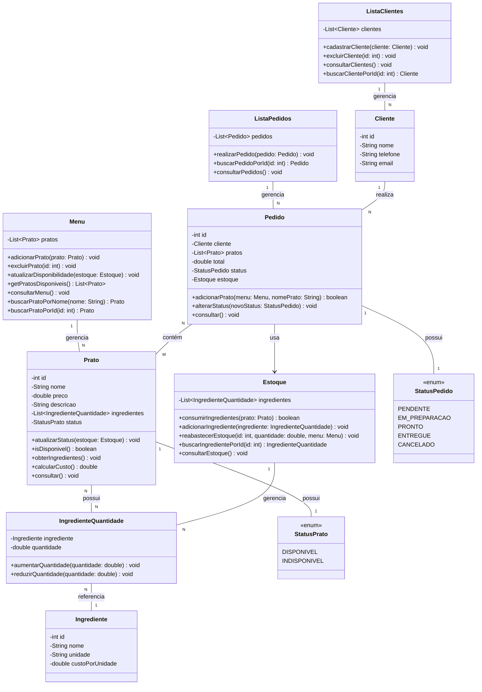

# Sistema de Gerenciamento de Restaurantes (Meu Menu) :pizza:

Projeto acadêmico da disciplina **Programação Orientada a Objetos (POO)** do curso **TADS**

## 📝 Proposta

Criar um sistema capaz de gerenciar as principais tarefas de um restaurante, a saber:

- Cadastrar pratos, pedidos, mesas e clientes
- Controlar estoque de ingredientes
- Gerar comandas e fechar contas

---

## :pushpin: Requisitos

### Funcionais

- O sistema deve permitir o **cadastro, edição, exclusão e consulta** das entidades principais
- Deve haver funcionalidades específicas para o domínio do sistema
- O sistema deve gerar **relatórios** ou **listagens relevantes**

### Técnicos

- **Classes e Objetos:** Criar classes que representem as entidades do sistema, com atributos e métodos bem definidos
- **Encapsulamento:** Utilizar atributos privados e métodos públicos (getters e setters) para garantir o encapsulamento
- **Herança e Polimorfismo:** Criar hierarquias de classes e utilizar polimorfismo quando aplicável
- **Interfaces:** Definir interfaces para comportamentos comuns
- **Coleções:** Utilizar coleções como `ArrayList`, `HashMap`, etc., para armazenar listas de objetos
- **Exceções:** Implementar tratamento de exceções para situações de erro
- **Persistência de Dados:** Salvar e carregar dados em arquivos (ex: `.txt`, `.csv`)

---

## :coffee: Decisões Projetuais

- Conferir à classe `Estoque` o controle da disponibilidade dos **pratos** no **menu** do restaurante, de acordo com a quantidade de **ingredientes** que cada prato necessita

- A quantidade de **ingredientes** no Estoque vai ser fator determinante para a disponibilidade de um **prato** no menu e, consequentemente, para a realização de um **pedido**

---

## :file_folder: Estrutura do Projeto

### Diretórios

- `src/application`: Contém a classe principal executável, que realiza a interação com o usuário (`Main`)
- `src/entities`: Contém as entidades do sistema (`Prato`, `Cliente`, `Estoque`, `Ingrediente`, `Menu`, ...)
- `src/entities/enums`: Contém tipos enumerados (`StatusPedido`, `StatusPrato`)

---

## :wrench: Funcionalidades

- **Consultar o Menu**: exibe os pratos cadastrados
- **Adicionar prato ao Menu**: adiciona novos pratos ao Menu
- **Excluir prato do Menu**: exclui um prato do Menu
- **Consultar Estoque de Ingredientes**: exibe os ingredientes no estoque com as respectivas quantidades
- **Adicionar ingredientes ao Estoque**: adiciona novos ingredientes no estoque
- **Fazer um pedido**: realiza um pedido de acordo com os pratos disponíveis no menu
- **Cancelar um pedido**: altera o status do pedido para cancelado
- **Consultar pedidos**: exibe lista de pedidos realizados
- **Alterar status de um pedido**: altera o status de um pedido
- **Cadastrar novo Cliente**: adiciona um novo cliente a lista de clientes
- **Consultar lista de Clientes**: exibe lista de clientes cadastrados
- **Excluir Cliente**: exclui um cliente da lista de clientes

---

## :bar_chart: Diagrama UML

Classes e seus relacionamentos

---
## 📄 Licença

Este projeto está licenciado sob a **Licença MIT**. Consulte o arquivo [LICENSE](LICENSE) para mais detalhes.

---

## 🤝 Contribuição

Contribuições são bem-vindas! Para sugestões ou melhorias, abra uma **issue** ou envie um **pull request**
