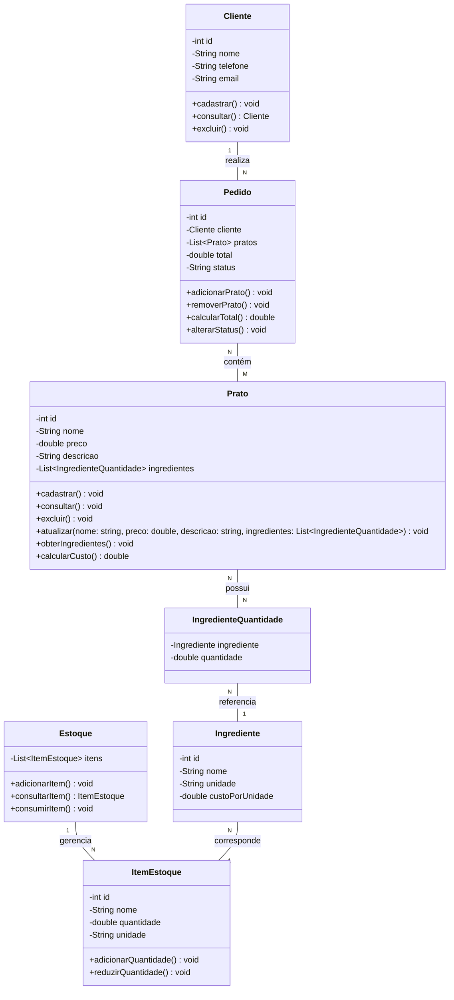

# Projeto-POO

### Sistema de Gerenciamento de Restaurantes (Meu Menu)

```mermaid
classDiagram
    class Prato {
        -int id
        -String nome
        -double preco
        -String descricao
        -List~IngredienteQuantidade~ ingredientes
        +cadastrar() void
        +consultar() void
        +excluir() void
        +atualizar(nome: string, preco: double, descricao: string, ingredientes: List~IngredienteQuantidade~) void
        +obterIngredientes() void
        +calcularCusto() double
    }

    class Ingrediente {
        -int id
        -String nome
        -String unidade
        -double custoPorUnidade
    }

    class IngredienteQuantidade {
        -Ingrediente ingrediente
        -double quantidade
    }

    class Cliente {
        -int id
        -String nome
        -String telefone
        -String email
        +cadastrar() void
        +consultar() Cliente
        +excluir() void
    }

    class Pedido {
        -int id
        -Cliente cliente
        -List~Prato~ pratos
        -double total
        -String status
        +adicionarPrato() void
        +removerPrato() void
        +calcularTotal() double
        +alterarStatus() void
    }

    class Estoque {
        -List~ItemEstoque~ itens
        +adicionarItem() void
        +consultarItem() ItemEstoque
        +consumirItem() void
    }

    class ItemEstoque {
        -int id
        -String nome
        -double quantidade
        -String unidade
        +adicionarQuantidade() void
        +reduzirQuantidade() void
    }

    Prato "N" -- "N" IngredienteQuantidade : possui
    IngredienteQuantidade "N" -- "1" Ingrediente : referencia
    Pedido "N" -- "M" Prato : contém
    Cliente "1" -- "N" Pedido : realiza
    Estoque "1" -- "N" ItemEstoque : gerencia
    Ingrediente "N" -- "1" ItemEstoque : corresponde
```
